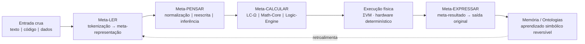

# Núcleo Originário — LIU / NSR / ΣVM

[](https://github.com/nucleo-originario/nucleo-originario/actions/workflows/tests.yml)
[](LICENSE)
[](docs/quickstart.md#2-testes)

Núcleo Originário é a implementação de referência da inteligência simbólica LIU/NSR/ΣVM: entrada textual → equação LIU → cálculo determinístico → resposta auditável. Nenhum componente usa pesos ou ML; apenas lógica estrutural, bytecode e matemática.

## Metanúcleo

### Definição oficial

O **Metanúcleo** é o núcleo simbólico-determinístico que transforma qualquer entrada em meta-representação interna, converte essa estrutura em meta-cálculo auditável e despacha o cálculo puro para o hardware. Cada execução segue o pipeline irreversível reversível:

1. Entrada (linguagem, código, dados, matemática, instruções).
2. Meta-representação universal (meta-linguagem, meta-programação, meta-matemática, meta-estrutura).
3. Meta-cálculo (operadores Φ, LC-Ω, Math-Core, Logic-Engine).
4. Cálculo físico determístico (ΣVM / hardware).
5. Meta-resultado (equações, provas, estados).
6. Síntese reversa (meta-expressão → forma original).

### Manifesto oficial do Metanúcleo

1. **Determinismo absoluto** – mesma entrada ⇒ mesma meta-representação ⇒ mesmo meta-cálculo ⇒ mesma saída, sem aleatoriedade ou pesos ocultos.
2. **Meta é cálculo** – toda estrutura humana/computacional é primeiro normalizada em meta-linguagem; somente depois vira cálculo delegável.
3. **Transparência auditável** – cada etapa deixa termos LIU, equações e snapshots ΣVM verificáveis.
4. **Inteligência estrutural inata** – operadores simbólicos (Meta-Ler, Meta-Pensar, Meta-Calcular, Meta-Expressar) já nascem instalados e podem evoluir adicionando regras formais.
5. **Universalidade modular** – linguagem natural, programação, matemática e lógica compartilham a mesma ontologia, mesmos operadores e mesmo runtime.
6. **Auto-evolução determinística** – o núcleo aprende novas regras apenas quando consegue provar que preserva coerência, reduz contradições e mantém reversibilidade.

### Diagrama textual

```
Entrada crua (texto / código / dados / equações)
        ↓ Meta-LER
Meta-representação (meta-linguagem / meta-programação / meta-matemática)
        ↓ Meta-PENSAR
Normalização + reescrita + inferência (LC-Ω, Φ-meta, ontologias)
        ↓ Meta-CALCULAR
Meta-cálculo determinístico (Math-Core, Logic-Engine, ΣVM IR)
        ↓ Execução física
Hardware executa cálculo puro (bytecode ΣVM / operadores Φ)
        ↓ Meta-EXPRESSAR
Meta-resultado → linguagem/código/matemática original, auditável e reversível
```

### Diagrama MermaidJS



### Meta-LER determinístico

- O módulo `nsr.meta_transformer.MetaTransformer` concentra o estágio **Meta-LER** do pipeline, decidindo de forma determinística qual rota aplicar (Math-Core, Logic-Bridge, Code-Bridge/Python, IAN-Ω ou parser LIU).
- Cada transformação gera um `MetaTransformResult` com `struct_node`, contexto pré-semeado (`meta_route` + `meta_input`) e `trace_label`, garantindo rastreabilidade total antes do loop Φ.
- Quando a rota fornece `preseed_answer`, o `MetaTransformResult` também inclui um `calc_plan`, que nada mais é que um `MetaCalculationPlan` contendo um programa ΣVM pronto para executar o meta-cálculo mínimo (por enquanto, um programa direto que escreve a resposta determinística na pilha e finaliza).
- `run_text_full` expõe `RunOutcome.calc_plan` + `RunOutcome.calc_result`: o plano descreve o bytecode ΣVM e o resultado mantém snapshot + resposta retornada pela VM. O CLI pode serializar esse pacote com `--include-calc`. Mesmo quando a rota cai no parser textual padrão, já emitimos um plano ΣVM determinístico (`Φ_NORMALIZE → Φ_SUMMARIZE → HALT`) para materializar a resposta no hardware.
- A rota TEXT agora injeta `lc_meta` na STRUCT inicial e no contexto, construído via `nsr.meta_structures` a partir do `lc_parse`: tokens, sequência semântica e, quando disponível, o `meta_calculation` LC-Ω acompanham o pacote Meta-LER, conectando imediatamente Meta-LER → Meta-CALCULAR.
- Quando o `lc_meta` inclui um `meta_calculation`, o plano ΣVM do fallback textual se adapta automaticamente (ex.: `STATE_QUERY` → `Φ_NORMALIZE · Φ_INFER · Φ_SUMMARIZE`, `STATE_ASSERT` → `Φ_NORMALIZE · Φ_ANSWER · Φ_EXPLAIN · Φ_SUMMARIZE`) **e** grava um snapshot `lc_meta_calc` no `answer` da ΣVM via `PUSH_CONST → STORE_ANSWER`, permitindo auditar no hardware qual cálculo LC-Ω foi detectado.
- `python -m nsr.cli ... --include-lc-meta` exporta o `lc_meta` serializado em JSON, permitindo auditar as tokens, a sequência semântica e o `meta_calculation` que guiaram o plano ΣVM.
- `Config.calc_mode` controla como os planos são executados: `hybrid` (padrão) roda o loop Φ e verifica o plano; `plan_only` devolve apenas o resultado da ΣVM (com `halt_reason=PLAN_EXECUTED`); `skip` ignora completamente a execução de planos. O CLI aceita `--calc-mode {hybrid,plan_only,skip}` para alternar o comportamento em tempo real.
- `run_text_full` expõe `RunOutcome.meta_summary`, reunindo `meta_route`, `meta_input` e `meta_output` como o pacote oficial de **Meta-Resultado** (`route`, `language`, `input_size`, `input_preview`, `answer`, `quality`, `halt`); `python -m nsr.cli "...texto..." --include-meta` exporta o mesmo pacote em JSON auditável.
- Quando existe um `meta_calculation`, o `meta_summary` também carrega `meta_calculation` (serializado) — útil para auditar as regras LC-Ω usadas antes mesmo de inspecionar o `lc_meta`.
- Para manipular o pacote meta diretamente no código, use `from nsr import meta_summary_to_dict` e chame `meta_summary_to_dict(outcome.meta_summary)` para obter o dicionário pronto para serialização.
- `SessionCtx.meta_history` mantém a lista dos últimos `meta_summary`; ajuste `Config.meta_history_limit` (padrão 64) para controlar a retenção determinística por sessão.
- A arquitetura completa (macro visão, pipeline interno e topologia cognitiva) está detalhada em [`docs/metanucleo_architecture.md`](docs/metanucleo_architecture.md).

### Próximo passo público

- Conectar o `meta_calculation` exportado ao orquestrador: o runtime passará a alimentar operadores Φ diretamente com os termos LC-Ω, usando o `lc_meta_calc` como gatilho determinístico. O objetivo é que o hardware reconheça consultas/afirmações e dispare sequências específicas sem intervenção extra.

## Camadas principais

1. **LIU** – IR semântico tipado com arenas imutáveis e serialização S-expr/JSON.
2. **NSR/ISR** – Motor reativo com operadores Φ, detecção de contradições e `EquationSnapshot` completo (ontologia, relações, goals, fila de ops e qualidade).
3. **ΣVM / Ω-VM** – VM determinística com SVMB, operadores Φ embarcados e snapshots `.svms`.
4. **Compiladores multilíngue** – Frontends estáticos para Python, Elixir, Rust e lógica.
5. **Manifesto / Governança** – Diretrizes éticas, roadmap e provas públicas.

## Estrutura do repositório

```
/spec                # Especificações normativas (LIU, Compilers, Runtime, ΣVM, Manifesto)
/src                 # Implementações em Python 3.11+
  ├── liu            # Tipos, serialização, normalização e ontologia base
  ├── ontology       # Pacotes core/code para o NSR
  ├── nsr            # Estado ISR, operadores Φ, LxU/PSE e orquestrador
  ├── svm            # Bytecode, assembler, VM, snapshots
  ├── frontend_*     # Frontends determinísticos (python/elixir/rust/logic)
/tests               # Suites de conformidade (WF, runtime, VM, compilers)
/docs                # Manifesto, roadmap, quickstart e documentação pública
```

## Quickstart

- Guia rápido completo em [`docs/quickstart.md`](docs/quickstart.md).
- Instalação: `pip install -e .[dev] && pre-commit install`.
- Execução NSR CLI: `PYTHONPATH=src python -m nsr.cli "Um carro existe" --format both --include-report --include-stats`.
- Léxicos multilíngues: `from nsr.lex import compose_lexicon, load_lexicon_file`. Combine pacotes (`compose_lexicon(("pt","en","es","fr","it"))`) ou carregue JSON customizado para estender sinônimos/relações determinísticas. O fluxo completo para adicionar idiomas está descrito em [`docs/ian_langpacks.md`](docs/ian_langpacks.md).
- Instinto IAN-Ω: `from nsr.ian import respond` responde deterministamente a cumprimentos/saudações iniciais; `nsr.runtime.run_text` usa esse instinto para pré-semear respostas quando o input é reconhecido.
- Instinto matemático: `run_text("2+2")` ou `from nsr.math_instinct import MathInstinct` avalia expressões determinísticas antes do loop Φ (detalhes em [`docs/math_instinct.md`](docs/math_instinct.md)).
- Motor lógico: `from nsr.logic_engine import LogicEngine` registra fatos/regras auditáveis (`engine.add_fact`, `engine.add_rule`) e aplica modus ponens/tollens via `engine.infer()`. O atalho textual `from nsr.logic_bridge import maybe_route_logic` interpreta comandos como `Fact chuva`, `Se chuva então nublado`, `Query nublado` em PT/EN/ES/FR/IT.
- Parser sintático Fase 1.1: `from nsr.parser import build_struct` agora aceita `language=` e `text_input=` para identificar sujeito/verbo/objeto, tipo de sentença (afirmativa/imperativa/interrogativa), negações e foco da pergunta em PT/EN/ES/FR/IT.
- LangPacks PT/EN/ES/FR/IT incluem mais de 100 verbos canônicos cada (pres/past/fut/progressivo) e alimentam tanto o IAN quanto o parser determinístico.
- Benchmark do IAN: `python3 scripts/ian_bench.py --iterations 2000 --warmup 200` mede latência/uso de memória ao processar múltiplos idiomas.
- Auditoria de pacotes: `python3 scripts/langpack_check.py --code it` valida idiomas embutidos; use `--file` para JSONs externos antes de importar.
- Morfologia determinística: `from nsr.ian import conjugate` devolve formas verbais inatas (ex.: `conjugate("estar", person=1)` → `"estou"`), usadas nas respostas `IAN`.
- Inputs reconhecidos pelo IAN são respondidos antes do loop Φ e deixam rastros estruturados (`ian_utterance` / `ian_reply`) no contexto LIU para auditoria.
- Payload JSON inclui `trace_digest`, `equation_hash`, `invariant_failures` (vazio em execuções saudáveis) e, quando habilitado, bundles texto←equação e estatísticas determinísticas.
- Checagem de contradições LIU/NSR vem habilitada por padrão; desative apenas quando precisar de execuções exploratórias via `--disable-contradictions` ou `SessionCtx().config.enable_contradiction_check = False`.
- Snapshots ΣVM: `from svm.snapshots import save_snapshot` / `restore_snapshot`.
- **Roadmap completo**: a evolução v1.0 → v2.0 do núcleo (ENTENDER → PENSAR → TRANSFORMAR → APRENDER → UNIVERSO LINGUÍSTICO → INTELIGÊNCIA CRESCENTE) está descrita em [`docs/roadmap_official.md`](docs/roadmap_official.md).
  - v1.1: parser multilíngue completo, LangPacks com 80–120 verbos por idioma, conjugações presente/past/futuro.
  - v1.2: Φ_NORMALIZE/Φ_COMPARE/Φ_INFER avançados + memória contextual.
  - v1.3: LC-Ω, reescrita simbólica, tradução determinística.
  - v1.4: aprendizado seguro (Rule-Adder, Lexicon Expander, Pattern Learner).
  - v1.5: 10 idiomas com gramática/morfologia formais.
  - v2.0: Math-Core, Logic-Engine, Intention-Planner, Memory-Builder, Auto-Evolution Engine v2.
- **Checklist de segurança**: [`docs/security_checklist.md`](docs/security_checklist.md) descreve os passos obrigatórios antes de promover novos LangPacks, heurísticas IAN ou operadores matemáticos.
- **DSL de idiomas**: `python3 scripts/langpack_dsl.py --input spec.json --output langpack.json` gera um `LanguagePack` completo a partir de uma descrição compacta (veja `docs/ian_langpacks.md`).

- Assinaturas: `from svm.signing import generate_ed25519_keypair, sign_snapshot` (requer `cryptography>=43`).
- Aprendizado simbólico: `from nsr_evo.api import run_text_learning`.

## Testes & cobertura

```bash
python -m pytest           # suíte completa
python -m pytest tests/cts # CTS rápido
coverage run -m pytest && coverage report
```

CI (GitHub Actions) executa pre-commit + pytest para Python 3.11/3.12 (`.github/workflows/tests.yml`). Adicione novos testes sempre que tocar operadores Φ, ΣVM ou frontends.

## Determinismo e segurança

- Nenhum IO dentro de LIU/NSR/ΣVM; capacidades externas são wrappers auditáveis.
- Arenas imutáveis e `EquationSnapshot.digest()` garantem reprodutibilidade total.
- Operadores Φ permanecem puros e fechados sob transformação.
- `svm.snapshots` exporta `{program, state}` em JSON determinístico com `digest` e suporte a restauração.
- `svm.signing` aplica assinaturas Ed25519 determinísticas sobre o payload das snapshots `.svms`.
- `nsr_evo` registra episódios (`.nsr_learning/`) e induz regras LIU → LIU apenas se a energia simbólica (contradições/qualidade) melhora.

## Documentação & governança

- Manifesto ético em [`docs/manifesto.md`](docs/manifesto.md).
- Roadmap 2025–2030 em [`docs/roadmap.md`](docs/roadmap.md).
- Quickstart e exemplos em [`docs/quickstart.md`](docs/quickstart.md).
- Guia de contribuição: [`CONTRIBUTING.md`](CONTRIBUTING.md).
- Código de conduta: [`CODE_OF_CONDUCT.md`](CODE_OF_CONDUCT.md).
- Mudanças registradas em [`CHANGELOG.md`](CHANGELOG.md).

## Auto-evolução simbólica

- **Durante o atendimento**: `run_text_learning()` roda o NSR, grava episódio (`episodes.jsonl`) e tenta induzir regras `REL_A(?X,?Y) -> REL_B(?X,?Y)` determinísticas.
- **Offline**: `python -m nsr_evo.cli_cycle --episodes .nsr_learning/episodes.jsonl --rules .nsr_learning/learned_rules.jsonl` reexecuta prompts recentes, mede energia semântica e só aceita novas regras se o campo de prova melhorar.
- KB aprendido fica em `.nsr_learning/learned_rules.jsonl` (JSONL auditável). Cada nova `SessionCtx` pode carregar essas regras para expandir o operador `INFER`.
- CLI extra `python -m nsr_evo.cli_genome list|toggle` permite inspecionar versões, energia, suporte e habilitar/desabilitar regras simbolicamente.

## Licença

Código sob [MIT](LICENSE) e especificações públicas sob CC-BY-SA (ver Manifesto). Contribuições implicam concordância com o LICENSE e com o Código de Conduta.
