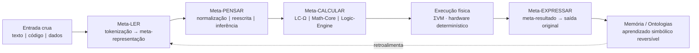

# Núcleo Originário — LIU / NSR / ΣVM

[](https://github.com/nucleo-originario/nucleo-originario/actions/workflows/tests.yml)
[](LICENSE)
[](docs/quickstart.md#2-testes)

Núcleo Originário é a implementação de referência da inteligência simbólica LIU/NSR/ΣVM: entrada textual → equação LIU → cálculo determinístico → resposta auditável. Nenhum componente usa pesos ou ML; apenas lógica estrutural, bytecode e matemática.

## Metanúcleo

### Definição oficial

O **Metanúcleo** é o núcleo simbólico-determinístico que transforma qualquer entrada em meta-representação interna, converte essa estrutura em meta-cálculo auditável e despacha o cálculo puro para o hardware. Cada execução segue o pipeline irreversível reversível:

1. Entrada (linguagem, código, dados, matemática, instruções).
2. Meta-representação universal (meta-linguagem, meta-programação, meta-matemática, meta-estrutura).
3. Meta-cálculo (operadores Φ, LC-Ω, Math-Core, Logic-Engine).
4. Cálculo físico determístico (ΣVM / hardware).
5. Meta-resultado (equações, provas, estados).
6. Síntese reversa (meta-expressão → forma original).

### Manifesto oficial do Metanúcleo

1. **Determinismo absoluto** – mesma entrada ⇒ mesma meta-representação ⇒ mesmo meta-cálculo ⇒ mesma saída, sem aleatoriedade ou pesos ocultos.
2. **Meta é cálculo** – toda estrutura humana/computacional é primeiro normalizada em meta-linguagem; somente depois vira cálculo delegável.
3. **Transparência auditável** – cada etapa deixa termos LIU, equações e snapshots ΣVM verificáveis.
4. **Inteligência estrutural inata** – operadores simbólicos (Meta-Ler, Meta-Pensar, Meta-Calcular, Meta-Expressar) já nascem instalados e podem evoluir adicionando regras formais.
5. **Universalidade modular** – linguagem natural, programação, matemática e lógica compartilham a mesma ontologia, mesmos operadores e mesmo runtime.
6. **Auto-evolução determinística** – o núcleo aprende novas regras apenas quando consegue provar que preserva coerência, reduz contradições e mantém reversibilidade.

### Diagrama textual

```
Entrada crua (texto / código / dados / equações)
        ↓ Meta-LER
Meta-representação (meta-linguagem / meta-programação / meta-matemática)
        ↓ Meta-PENSAR
Normalização + reescrita + inferência (LC-Ω, Φ-meta, ontologias)
        ↓ Meta-CALCULAR
Meta-cálculo determinístico (Math-Core, Logic-Engine, ΣVM IR)
        ↓ Execução física
Hardware executa cálculo puro (bytecode ΣVM / operadores Φ)
        ↓ Meta-EXPRESSAR
Meta-resultado → linguagem/código/matemática original, auditável e reversível
```

### Diagrama MermaidJS



### Meta-LER determinístico

- O módulo `nsr.meta_transformer.MetaTransformer` concentra o estágio **Meta-LER** do pipeline, decidindo de forma determinística qual rota aplicar (Math-Core, Logic-Bridge, Code-Bridge/Python, IAN-Ω ou parser LIU).
- Cada transformação gera um `MetaTransformResult` com `struct_node`, contexto pré-semeado (`meta_route` + `meta_input`) e `trace_label`, garantindo rastreabilidade total antes do loop Φ.
- Quando a rota fornece `preseed_answer`, o `MetaTransformResult` também inclui um `calc_plan`, que nada mais é que um `MetaCalculationPlan` contendo um programa ΣVM pronto para executar o meta-cálculo mínimo (por enquanto, um programa direto que escreve a resposta determinística na pilha e finaliza).
- `run_text_full` expõe `RunOutcome.calc_plan` + `RunOutcome.calc_result`: o plano descreve o bytecode ΣVM e o resultado mantém snapshot + resposta retornada pela VM. O CLI pode serializar esse pacote com `--include-calc`. Mesmo quando a rota cai no parser textual padrão, já emitimos um plano ΣVM determinístico (`Φ_NORMALIZE → Φ_SUMMARIZE → HALT`) para materializar a resposta no hardware.
- A rota TEXT agora injeta `lc_meta` na STRUCT inicial e no contexto, construído via `nsr.meta_structures` a partir do `lc_parse`: tokens, sequência semântica e, quando disponível, o `meta_calculation` LC-Ω acompanham o pacote Meta-LER, conectando imediatamente Meta-LER → Meta-CALCULAR.
- Quando o `lc_meta` inclui um `meta_calculation`, o plano ΣVM do fallback textual se adapta automaticamente (ex.: `STATE_QUERY` → `Φ_NORMALIZE · Φ_INFER · Φ_SUMMARIZE`, `STATE_ASSERT` → `Φ_NORMALIZE · Φ_ANSWER · Φ_EXPLAIN · Φ_SUMMARIZE`) **e** grava um snapshot `lc_meta_calc` no `answer` da ΣVM via `PUSH_CONST → STORE_ANSWER`, permitindo auditar no hardware qual cálculo LC-Ω foi detectado.
- Um detector determinístico de idioma/dialeto (`nsr.language_detector.detect_language_profile`) roda antes do roteamento, alimenta o `language_hint`, gera o nó `language_profile` (categoria, confiança, pistas e dialeto de código quando aplicável) no contexto inicial e garante que o parser/lexicon recebam o idioma correto mesmo sem pistas externas.
- Código Python e Rust agora são convertidos em representações estruturais: `nsr.code_ast.build_python_ast_meta` serializa o AST real para snippets Python, enquanto `nsr.code_ast.build_rust_ast_meta` gera um outline determinístico (funções, parâmetros, retorno, corpo) para Rust; ambos aportam um `code_ast` no contexto/meta_summary, permitindo auditar módulos detectados pelo `language_detector`. Para matemática, `nsr.math_ast.build_math_ast_node` transforma instruções do Math-Core em `math_ast` (operador, expressão, operandos, valor), expondo o cálculo simbólico em todos os caminhos Math.
- O operador `REWRITE_CODE` (Φ formal nova) inspecciona `code_ast` presentes no contexto, gera resumos determinísticos (`code_ast_summary`) e relações `code/FUNCTION_COUNT`, abrindo caminho para pipelines Φ específicos de programação antes de `Φ_NORMALIZE`/`Φ_INFER`.
- `Φ_NORMALIZE` foi elevado a deduplicador estrutural: remove relações repetidas após normalização, ordena o grafo, cria um `normalize_summary` (total, deduplicados, removidos) e já deixa rastros auditáveis no contexto LIU antes das próximas Φ. Com `Config.normalize_aggressive=True`, o operador aplica uma heurística determinística que considera apenas os argumentos não textuais como chave e mantém a versão mais curta/leve das relações redundantes, registrando `aggressive_removed` no resumo e expondo esses totais diretamente no `meta_reasoner` (a linha `NORMALIZE[...]` mostra `tot/dedup/rem/agg` no trace).
- Sempre que um plano ΣVM é emitido (rotas MATH/LOGIC/CODE/INSTINCT/TEXT), o MetaTransformer adiciona um `meta_plan` ao contexto inicial e ao `meta_summary`, contendo `plan_digest` (BLAKE2b das instruções+constantes), descrição humana, contagem de instruções/constantes e, quando aplicável, a cadeia Φ (`phi_plan_chain`). O CLI (`--include-meta`) expõe os mesmos campos (`phi_plan_description`, `phi_plan_digest`, `phi_plan_program_len`, `phi_plan_const_len`) para auditoria externa.
- Cada `meta_summary` recebe um `meta_digest` calculado com BLAKE2b-128 (digest_size=16, sem chave/salt) sobre os fingerprints LIU canonizados, permitindo verificar end-to-end que rota, inputs, cálculos e ASTs não foram alterados entre Meta-LER → Meta-Resultado; o CLI e a API retornam esse hash pronto para auditoria.
- `python -m nsr.cli ... --include-lc-meta` exporta o `lc_meta` serializado em JSON, permitindo auditar as tokens, a sequência semântica e o `meta_calculation` que guiaram o plano ΣVM.
- `Config.calc_mode` controla como os planos são executados: `hybrid` (padrão) roda o loop Φ e verifica o plano; `plan_only` devolve apenas o resultado da ΣVM (com `halt_reason=PLAN_EXECUTED`); `skip` ignora completamente a execução de planos. O CLI aceita `--calc-mode {hybrid,plan_only,skip}` para alternar o comportamento em tempo real.
- `run_text_full` expõe `RunOutcome.meta_summary`, reunindo `meta_route`, `meta_input`, `meta_output` **e**, quando disponível, `meta_plan` (cadeia Φ pronta) como o pacote oficial de **Meta-Resultado** (`route`, `language`, `input_size`, `input_preview`, `answer`, `quality`, `halt`, `phi_plan_chain`); `python -m nsr.cli "...texto..." --include-meta` exporta o mesmo pacote em JSON auditável.
- `python -m nsr.cli "...texto..." --include-meta --expect-meta-digest HEX` valida, no próprio CLI, que o `meta_digest` calculado corresponde ao hash informado (fecha o elo auditoria meta-summary ↔ consumidor externo).
- `python -m nsr.cli "...código..." --expect-code-digest HEX` garante que o `code_summary_digest` (hash Blake2b do AST resumido) corresponde ao valor esperado; funciona tanto com `--include-meta` quanto com `--include-code-summary`.
- `python -m nsr.cli "...código..." --include-meta --expect-code-functions N` valida simbolicamente quantas funções determinísticas foram detectadas no resumo (`code_ast_summary`), útil para pipelines que exigem invariantes estruturais.
- `python -m nsr.cli "...código..." --include-meta --expect-code-function-name soma` exige que o resumo contenha uma função específica (repita a flag para múltiplas); combinado com `--include-code-summary`, permite auditar nomes/assinaturas determinísticas.
- `python -m nsr.cli "...texto..." --include-equation-trend` exporta o bloco `meta_equation` completo (digests, trend e deltas por seção), ideal para dashboards que acompanham a evolução do grafo LIU.
- `python -m nsr.cli "QUERY ... " --include-meta --include-proof` publica um bloco `proof_detail` com verdade/query/digest e o `logic_proof` completo produzido por `Φ_PROVE`, garantindo auditoria determinística de consultas lógicas.
- `--include-code-summary` injeta o `code_ast_summary` serializado diretamente no payload principal (sem depender do pacote meta), permitindo exportar idioma, contagem de nós/funções e digest do AST para auditoria externa.
- Cada `code_ast_summary` inclui a lista determinística de funções detectadas (nome + `param_count` quando disponível), garantindo rastreabilidade simbólica do snippet analisado.
- O `meta_reasoner` expõe `delta_quality` e `delta_relations` em cada `reasoning_step`, quantificando numericamente o impacto de cada operador Φ no estado LIU.
- `Φ_PROVE` integra o `logic_engine` ao loop Φ: consultas `FACT_QUERY`/`FACT_FOLLOWUP` agora executam PROVE após INFER, registrando um `logic_proof` no contexto (fatos conhecidos, derivados e verdade atual da consulta) e espelhando esse resumo no `meta_summary`.
- Quando existe um `meta_calculation`, o `meta_summary` também carrega `meta_calculation` (serializado) e o `meta_plan` correspondente — útil para auditar as regras LC-Ω e a sequência Φ planejada antes mesmo de inspecionar o `lc_meta`.
- O `meta_summary` também inclui um bloco `meta_calc_exec` sempre que um plano ΣVM é executado: rota/descrição do plano, flag `consistent`, erro (se houver), fingerprint da resposta e `snapshot_digest` BLAKE2b-128 (digest_size=16, sem chave/salt) do snapshot ΣVM (com `pc`/`stack_depth`). O CLI exporta esses campos como `calc_exec_*`, ligando o Meta-Cálculo à execução física auditável.
- O runtime consome o `meta_calculation` detectado (via `lc_meta_calc`), injeta a mesma sequência Φ na fila do NSR **e** registra `Φ_PLAN[...]` no `trace`, garantindo que consultas `STATE_QUERY` executem `NORMALIZE → INFER → SUMMARIZE`, afirmações `STATE_ASSERT` disparem `NORMALIZE → ANSWER → EXPLAIN → SUMMARIZE` e assim por diante antes da fila padrão, mantendo ΣVM e loop Φ sincronizados do Meta-LER até o Meta-CALCULAR com auditoria explícita.
- Para manipular o pacote meta diretamente no código, use `from nsr import meta_summary_to_dict` e chame `meta_summary_to_dict(outcome.meta_summary)` para obter o dicionário pronto para serialização.
- `SessionCtx.meta_history` mantém a lista dos últimos `meta_summary`; ajuste `Config.meta_history_limit` (padrão 64) para controlar a retenção determinística por sessão.
- A arquitetura completa (macro visão, pipeline interno e topologia cognitiva) está detalhada em [`docs/metanucleo_architecture.md`](docs/metanucleo_architecture.md).

### Esquema oficial do `meta_plan` e do `phi_plan_digest`

- Cada `MetaCalculationPlan` serializado no `meta_summary` inclui os seguintes campos:
  - `phi_plan_route`: rota determinística (`text`, `logic`, `math`, `code` ou `instinct`).
  - `phi_plan_description`: identificador humano do plano ΣVM (ex.: `text_phi_pipeline`).
  - `phi_plan_chain` / `phi_plan_ops`: cadeia Φ (`NORMALIZE→INFER→SUMMARIZE`) e lista ordenada dos operadores.
  - `phi_plan_program_len` e `phi_plan_const_len`: contagem estática de instruções ΣVM e constantes.
  - `phi_plan_digest`: `blake2b` (digest_size=16) calculado sobre `route`, `description`, `(opcode, operand)` e fingerprints das constantes LIU.
- O digest é validado via CTS em `tests/cts/test_meta_plan_digest.py`, com fixtures versionadas que garantem compatibilidade retroativa quando novas versões forem lançadas.
- Testes adicionais em `tests/nsr/test_plan_digest.py` asseguram que qualquer mudança nas instruções, na ordem dos opcodes ou no conteúdo das constantes provoca um novo hash — prova formal de imutabilidade do meta-cálculo.
- Antes da execução física, `svm.verifier.verify_program` valida cada plano (operandos, registradores, destinos de salto e `HALT` explícito); se a verificação falha, `execute_meta_plan` retorna um erro determinístico e não toca o hardware.
- Cada `meta_summary` também inclui `meta_equation`: um snapshot compactado da equação LIU (digests de entrada/resposta, qualidade, contagens e hashes de ontologia/relações/contexto/goals/fila Φ) **e** os deltas determinísticos em relação à execução anterior (delta de qualidade e delta de contagem/digest por seção), além do `trend` categórico (`initial`/`expanding`/`stable`/`regressing`), permitindo auditar o estado simbólico completo e sua evolução juntamente com o plano ΣVM e o raciocínio Φ. O CLI expõe o mesmo pacote via `--include-equation-trend`, exportando JSON pronto para dashboards externos.

## ♻️ Auto-evolução & PRs automáticos

O Metanúcleo não ajusta pesos: ele registra erros estruturados, gera patches determinísticos e pede revisão humana. O ciclo completo é o seguinte:

1. **Rode os testes** (`python -m pytest`). Eles exercitam semântica, regras e meta-cálculo e, em vez de quebrar a suíte, escrevem mismatches em `logs/*.jsonl`, `.meta/*.jsonl` e no hub central `.metanucleus/mismatch_log.jsonl`.
2. **Geradores de patch** (`IntentLexiconPatchGenerator`, `RulePatchGenerator`, `SemanticPatchGenerator`, `semantic_frames_auto_patch`, `meta_calculus_auto_patch`) leem esses registros e produzem diffs para `intent_lexicon.json`, `rule_suggestions.md`, `semantic_suggestions.md`, `.metanucleus/frame_patterns.json` e `metanucleus/config/meta_calculus_rules.json`.
3. **MetaKernel** consolida tudo via `run_auto_evolution_cycle(domains=[...], apply_changes=...)`, devolvendo `EvolutionPatch` (domínio, título, descrição, diff).
4. **CLI / Orquestrador**

   ```bash
   # Mostra os patches sem alterar arquivos
   metanucleus-auto-evolve --dry-run

   # Aplica domínios específicos e já cria branch/commit/push
   metanucleus-auto-evolve semantic_frames meta_calculus --commit --push

   # Versão interativa do ciclo (sem git)
   metanucleus-evo-cli rules semantics --dry-run
   ```

5. **GitHub Actions** (`.github/workflows/metanucleus-auto-evolution.yml`) executa em todo push para `main`: instala dependências, roda `python -m pytest || true`, chama `metanucleus-auto-evolve all --apply` e, se houver diffs, cria uma branch `auto-evolve/<run_id>` + PR usando `peter-evans/create-pull-request`.
6. **Daemon 24/7 opcional** (`metanucleus-daemon`) roda o mesmo processo continuamente em qualquer servidor: dá `git pull`, executa testes, chama `MetaKernel.run_auto_evolution_cycle(..., apply_changes=True)`, revalida os testes, cria branch/commit/push e abre PR direto via GitHub API. Configure:

   ```bash
   export GITHUB_TOKEN=ghp_xxx
   export GITHUB_REPOSITORY=owner/repo
   export METANUCLEUS_DAEMON_INTERVAL=600  # segundos
   metanucleus-daemon
   ```

7. **Revisão humana final**: cada PR contém diffs normais (semântica, intent, regras, meta-cálculo). Você só precisa revisar/mergear ou fechar.

Resumo do fluxo:

```
pytest → logs/mismatches → run_auto_evolution_cycle → EvolutionPatch → metanucleus-auto-evolve --apply → git branch/commit → PR automático → revisão humana
```

### Pipeline de auto-debug local

- `nucleo-auto-debug` roda `pytest` e, em caso de falha, encadeia `metanucleus-auto-evolve <domínios> --apply` antes de repetir a suíte.  
  ```bash
  nucleo-auto-debug --pytest-args "-k runtime -vv" --auto-evolve-domains all
  ```
- Persistência do NSR é desativada por padrão (`NSR_MEMORY_STORE_PATH/EPISODES_PATH/INDUCTION_RULES_PATH=""`), evitando que arquivos em `.nsr_memory/` e `.meta/` contaminem depurações determinísticas.
- Ajuste `--max-cycles` para controlar quantas tentativas executar, `--skip-auto-evolve` para apenas rodar os testes ou `--keep-memory` quando quiser reaproveitar o estado simbólico entre ciclos.
- Ideal para loops locais de autocura ou para integrar em jobs de CI que precisem tentar remediação automaticamente antes de falhar.
- Workflow GitHub [`auto-debug.yml`](.github/workflows/auto-debug.yml) expõe um gatilho `workflow_dispatch`/`workflow_call` para executar o mesmo pipeline direto na nuvem.
- Use `--report` (e opcionalmente `--report-json` / `--report-path`) para imprimir um resumo dos mismatches entre cada tentativa.
- Combine com `nucleo-auto-report` para resumir rapidamente `logs/*.jsonl` e `.meta/*.jsonl` após uma execução (use `--watch 5` para reemitir a cada 5s):
  ```bash
  nucleo-auto-report --json
  ```

## Camadas principais

1. **LIU** – IR semântico tipado com arenas imutáveis e serialização S-expr/JSON.
2. **NSR/ISR** – Motor reativo com operadores Φ, detecção de contradições e `EquationSnapshot` completo (ontologia, relações, goals, fila de ops e qualidade).
3. **ΣVM / Ω-VM** – VM determinística com SVMB, operadores Φ embarcados e snapshots `.svms`.
4. **Compiladores multilíngue** – Frontends estáticos para Python, Elixir, Rust e lógica.
5. **Manifesto / Governança** – Diretrizes éticas, roadmap e provas públicas.

## Estrutura do repositório

```
/spec                # Especificações normativas (LIU, Compilers, Runtime, ΣVM, Manifesto)
/src                 # Implementações em Python 3.11+
  ├── liu            # Tipos, serialização, normalização e ontologia base
  ├── ontology       # Pacotes core/code para o NSR
  ├── nsr            # Estado ISR, operadores Φ, LxU/PSE e orquestrador
  ├── svm            # Bytecode, assembler, VM, snapshots
  ├── frontend_*     # Frontends determinísticos (python/elixir/rust/logic)
/tests               # Suites de conformidade (WF, runtime, VM, compilers)
/docs                # Manifesto, roadmap, quickstart e documentação pública
```

## Quickstart

- Guia rápido completo em [`docs/quickstart.md`](docs/quickstart.md).
- Instalação: `pip install -e .[dev] && pre-commit install`.
- Execução NSR CLI: `PYTHONPATH=src python -m nsr.cli "Um carro existe" --format both --include-report --include-stats`.
- Léxicos multilíngues: `from nsr.lex import compose_lexicon, load_lexicon_file`. Combine pacotes (`compose_lexicon(("pt","en","es","fr","it"))`) ou carregue JSON customizado para estender sinônimos/relações determinísticas. O fluxo completo para adicionar idiomas está descrito em [`docs/ian_langpacks.md`](docs/ian_langpacks.md).
- Instinto IAN-Ω: `from nsr.ian import respond` responde deterministamente a cumprimentos/saudações iniciais; `nsr.runtime.run_text` usa esse instinto para pré-semear respostas quando o input é reconhecido.
- Instinto matemático: `run_text("2+2")` ou `from nsr.math_instinct import MathInstinct` avalia expressões determinísticas antes do loop Φ (detalhes em [`docs/math_instinct.md`](docs/math_instinct.md)).
- Motor lógico: `from nsr.logic_engine import LogicEngine` registra fatos/regras auditáveis (`engine.add_fact`, `engine.add_rule`) e aplica modus ponens/tollens via `engine.infer()`. O atalho textual `from nsr.logic_bridge import maybe_route_logic` interpreta comandos como `Fact chuva`, `Se chuva então nublado`, `Query nublado` em PT/EN/ES/FR/IT.
- Parser sintático Fase 1.1: `from nsr.parser import build_struct` agora aceita `language=` e `text_input=` para identificar sujeito/verbo/objeto, tipo de sentença (afirmativa/imperativa/interrogativa), negações e foco da pergunta em PT/EN/ES/FR/IT.
- LangPacks PT/EN/ES/FR/IT incluem mais de 100 verbos canônicos cada (pres/past/fut/progressivo) e alimentam tanto o IAN quanto o parser determinístico.
- Benchmark do IAN: `python3 scripts/ian_bench.py --iterations 2000 --warmup 200` mede latência/uso de memória ao processar múltiplos idiomas.
- Auditoria de pacotes: `python3 scripts/langpack_check.py --code it` valida idiomas embutidos; use `--file` para JSONs externos antes de importar.
- Morfologia determinística: `from nsr.ian import conjugate` devolve formas verbais inatas (ex.: `conjugate("estar", person=1)` → `"estou"`), usadas nas respostas `IAN`.
- Inputs reconhecidos pelo IAN são respondidos antes do loop Φ e deixam rastros estruturados (`ian_utterance` / `ian_reply`) no contexto LIU para auditoria.
- Payload JSON inclui `trace_digest`, `equation_hash`, `invariant_failures` (vazio em execuções saudáveis) e, quando habilitado, bundles texto←equação e estatísticas determinísticas.
- Checagem de contradições LIU/NSR vem habilitada por padrão; desative apenas quando precisar de execuções exploratórias via `--disable-contradictions` ou `SessionCtx().config.enable_contradiction_check = False`.
- Snapshots ΣVM: `from svm.snapshots import save_snapshot` / `restore_snapshot`.
- **Roadmap completo**: a evolução v1.0 → v2.0 do núcleo (ENTENDER → PENSAR → TRANSFORMAR → APRENDER → UNIVERSO LINGUÍSTICO → INTELIGÊNCIA CRESCENTE) está descrita em [`docs/roadmap_official.md`](docs/roadmap_official.md).
  - v1.1: parser multilíngue completo, LangPacks com 80–120 verbos por idioma, conjugações presente/past/futuro.
  - v1.2: Φ_NORMALIZE/Φ_COMPARE/Φ_INFER avançados + memória contextual.
  - v1.3: LC-Ω, reescrita simbólica, tradução determinística.
  - v1.4: aprendizado seguro (Rule-Adder, Lexicon Expander, Pattern Learner).
  - v1.5: 10 idiomas com gramática/morfologia formais.
  - v2.0: Math-Core, Logic-Engine, Intention-Planner, Memory-Builder, Auto-Evolution Engine v2.
- **Checklist de segurança**: [`docs/security_checklist.md`](docs/security_checklist.md) descreve os passos obrigatórios antes de promover novos LangPacks, heurísticas IAN ou operadores matemáticos.
- **DSL de idiomas**: `python3 scripts/langpack_dsl.py --input spec.json --output langpack.json` gera um `LanguagePack` completo a partir de uma descrição compacta (veja `docs/ian_langpacks.md`).

## 💬 Como conversar com o Metanúcleo

O Metanúcleo mantém um ciclo determinístico (LxU → PSE → LIU → Φ → ΣVM) e guarda memória curta por `session_id`. Você escolhe entre um REPL de terminal ou a API Python.

### 1. REPL (linha de comando)

```bash
metanucleus-chat
```

O comando acima inicia um console multi-turno (PT/EN) com comandos especiais (`/state`, `/debug`, `/sair`). Por trás, ele instancia um `MetaKernel`, cria uma sessão e chama `handle_turn()` a cada entrada. O estado interno pode ser inspecionado a qualquer momento com `/debug`.

### 2. API Python embutida

```python
from metanucleus.core.meta_kernel import MetaKernel

kernel = MetaKernel()
session_id = "console-demo"

while True:
    user = input("Você: ").strip()
    if user in {"sair", "exit", "quit"}:
        break
    if not user:
        continue

    result = kernel.handle_turn(
        user_text=user,
        session_id=session_id,
        enable_auto_evolution=False,
    )
    print("Metanúcleo:", result.answer_text)
```

### 3. Exemplos de prompts úteis

- **Saudação:** “oi, metanúcleo” → o núcleo responde com um cumprimento e já registra a intenção.
- **Pergunta estrutural:** “explica esta frase como estrutura lógica?” → o Metanúcleo descreve entidades, ações e modificadores.
- **Autoevolução:** “evolua a si mesmo usando os logs de mismatch” → o núcleo dispara o ciclo interno e relata o que faria (patches ficam para revisão humana).

### 4. Conversa + autoevolução

Toda conversa gera contexto LIU/ISR. Se alguma sentença for mal interpretada, os helpers de teste/REPL registram `SemanticMismatch` ou `IntentMismatch` em `logs/*.jsonl`. Esses logs são consumidos pelos geradores de patch (`IntentLexiconPatchGenerator`, `SemanticPatchGenerator`, etc.). Quando você roda `metanucleus-auto-evolve` (ou o daemon 24/7), os patches propostos refletem exatamente os erros que surgiram durante o chat.

- ### Processo de Release & CTS
  - Releases seguem tags semânticas `vX.Y.Z`. Antes de taggear, execute `python -m pytest` e `python -m pytest tests/cts` localmente, atualize o `CHANGELOG.md` e valide a compatibilidade descrita em [`docs/cts_policy.md`](docs/cts_policy.md).
  - Ao enviar a tag, o workflow [`release.yml`](.github/workflows/release.yml) recompila o pacote (`python -m build`), roda `pytest` e publica os artefatos gerados como evidência do build.
  - Qualquer alteração que impacte protocolos LIU/ΣVM/meta_summary deve documentar a migração no changelog e na política de CTS antes do merge.

- ### Política de Revisão
  - `CODEOWNERS` exige revisores específicos por área (`src/nsr/`, `src/svm/`, `docs/`). Consulte [`docs/review_policy.md`](docs/review_policy.md) para saber quantas aprovações são necessárias e como tratar exceções.
  - Mudanças que afetam protocolos (LIU/ΣVM/meta_summary) precisam de 2 aprovações (nsr-core + svm-core) e de evidências de CTS verde antes do merge.

- Assinaturas: `from svm.signing import generate_ed25519_keypair, sign_snapshot` (requer `cryptography>=43`).
- Aprendizado simbólico: `from nsr_evo.api import run_text_learning`.

## Testes & cobertura

```bash
python -m pytest           # suíte completa
python -m pytest tests/cts # CTS rápido
coverage run -m pytest && coverage report
```

CI (GitHub Actions) executa pre-commit + `coverage run -m pytest` para Python 3.11/3.12, publica o `coverage.xml` como artefato e roda TruffleHog para varredura de segredos (`.github/workflows/tests.yml`). Adicione novos testes sempre que tocar operadores Φ, ΣVM ou frontends.

## Determinismo e segurança

- Nenhum IO dentro de LIU/NSR/ΣVM; capacidades externas são wrappers auditáveis.
- Arenas imutáveis e `EquationSnapshot.digest()` garantem reprodutibilidade total.
- Operadores Φ permanecem puros e fechados sob transformação.
- `svm.snapshots` exporta `{program, state}` em JSON determinístico com `digest` e suporte a restauração.
- `svm.signing` aplica assinaturas Ed25519 determinísticas sobre o payload das snapshots `.svms`.
- `nsr_evo` registra episódios (`.nsr_learning/`) e induz regras LIU → LIU apenas se a energia simbólica (contradições/qualidade) melhora.

## Documentação & governança

- Manifesto ético em [`docs/manifesto.md`](docs/manifesto.md).
- Roadmap 2025–2030 em [`docs/roadmap.md`](docs/roadmap.md).
- Quickstart e exemplos em [`docs/quickstart.md`](docs/quickstart.md).
- Guia de contribuição: [`CONTRIBUTING.md`](CONTRIBUTING.md).
- Código de conduta: [`CODE_OF_CONDUCT.md`](CODE_OF_CONDUCT.md).
- Mudanças registradas em [`CHANGELOG.md`](CHANGELOG.md).

## Auto-evolução simbólica

- **Durante o atendimento**: `run_text_learning()` roda o NSR, grava episódio (`episodes.jsonl`) e tenta induzir regras `REL_A(?X,?Y) -> REL_B(?X,?Y)` determinísticas.
- **Offline**: `python -m nsr_evo.cli_cycle --episodes .nsr_learning/episodes.jsonl --rules .nsr_learning/learned_rules.jsonl` reexecuta prompts recentes, mede energia semântica e só aceita novas regras se o campo de prova melhorar.
- KB aprendido fica em `.nsr_learning/learned_rules.jsonl` (JSONL auditável). Cada nova `SessionCtx` pode carregar essas regras para expandir o operador `INFER`.
- CLI extra `python -m nsr_evo.cli_genome list|toggle` permite inspecionar versões, energia, suporte e habilitar/desabilitar regras simbolicamente.

## Licença

Código sob [MIT](LICENSE) e especificações públicas sob CC-BY-SA (ver Manifesto). Contribuições implicam concordância com o LICENSE e com o Código de Conduta.
